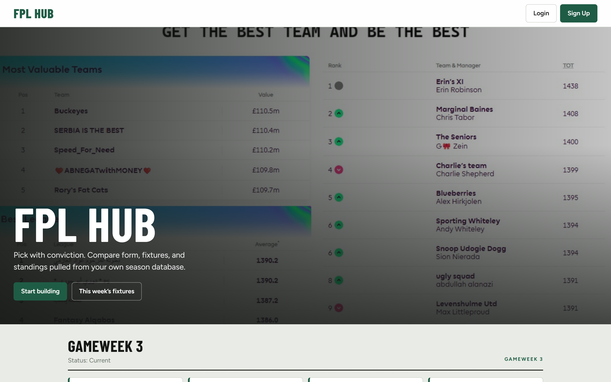
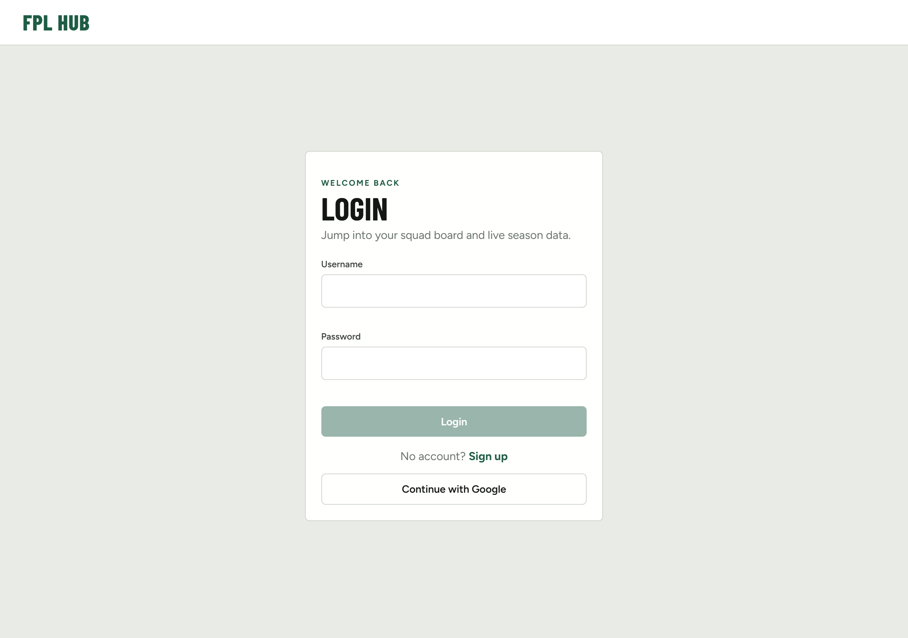
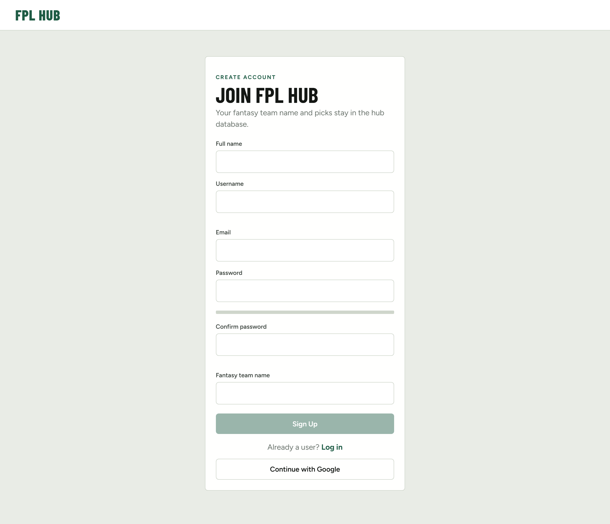
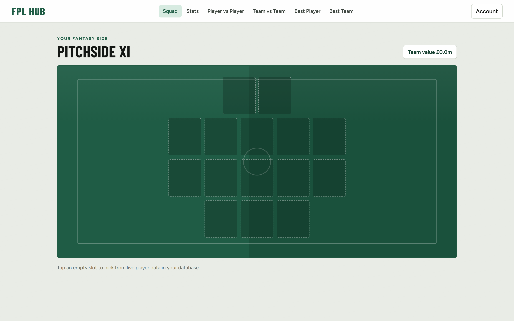
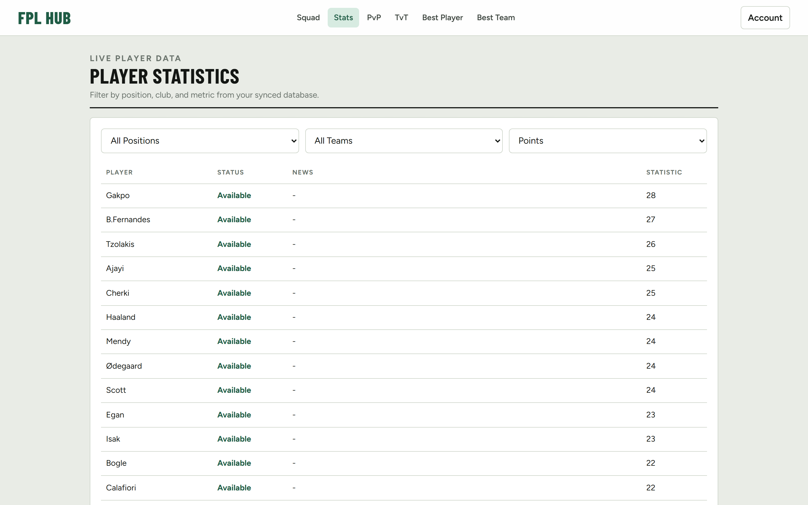
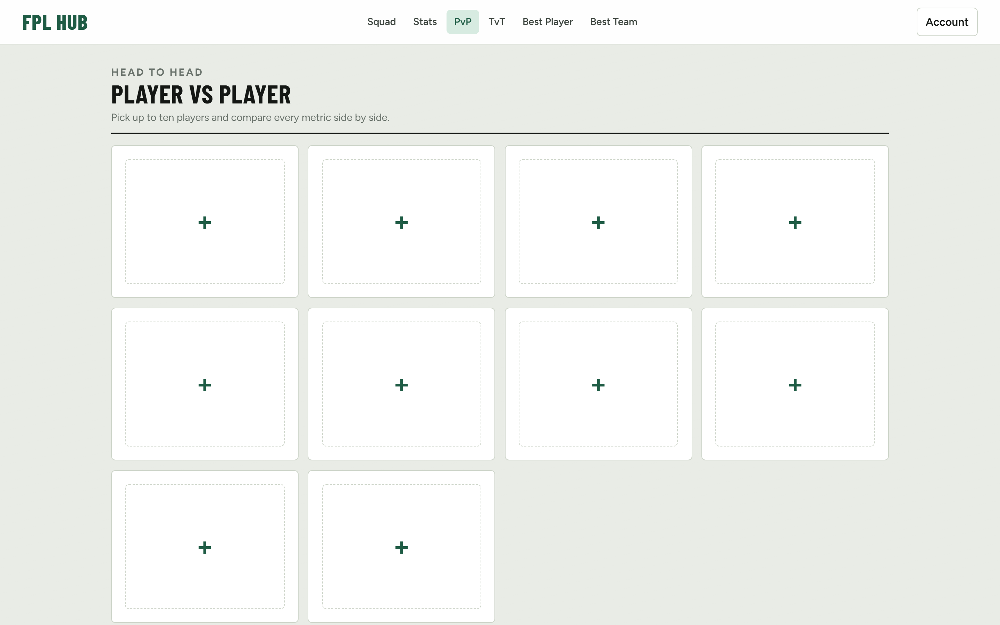
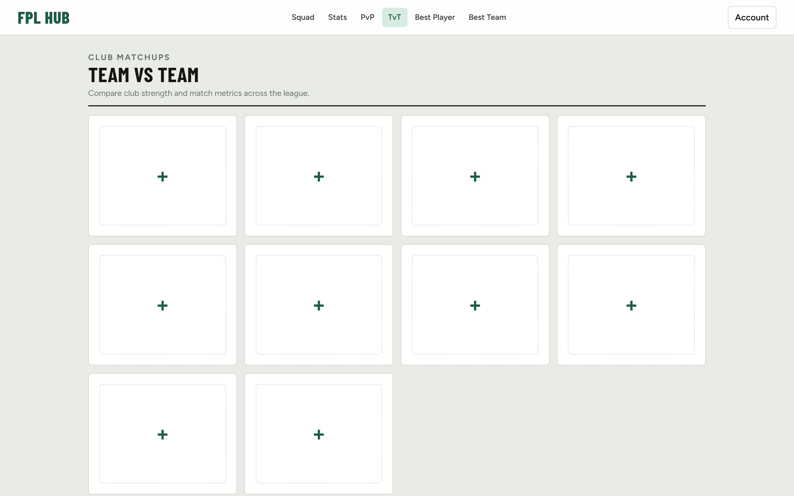
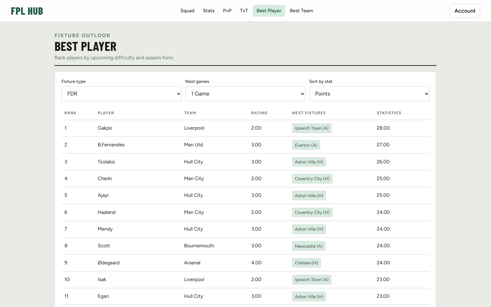
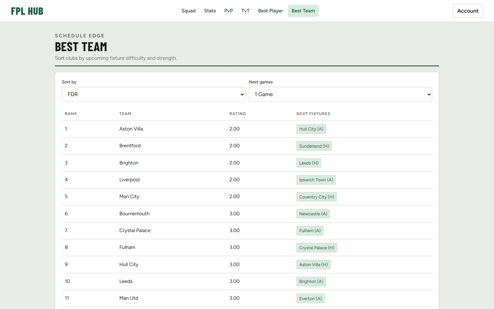

# FPL Hub

Fantasy Premier League companion app — pick a squad, compare players and teams, and browse live season data synced from the official FPL API into **Aiven MySQL**.

**Stack:** HTML / CSS / JS · PHP · Node fetcher · Aiven MySQL  
**Local URL:** [http://localhost/fpl_hub/](http://localhost/fpl_hub/)

---

## Screenshots

### Homepage
Hero, current gameweek fixtures, and league table from the database.



### Login


### Sign up


### Dashboard (squad builder)
Logged in as `demo_manager` — fantasy side **Pitchside XI**.



### Player stats


### Player vs player


### Team vs team


### Best player (fixture + form tools)


### Best team


---

## Demo test users

Use these accounts on local login (password login, not Google):

| Username | Password | Fantasy team | Email |
|----------|----------|--------------|-------|
| `demo_manager` | `Demo@1234` | Pitchside XI | demo@fplhub.local |
| `test_captain` | `Test@1234` | Night Watch FC | captain@fplhub.local |
| `scout_analyst` | `Scout@1234` | Green Notebook | scout@fplhub.local |

> Passwords meet the signup strength rules (8+ chars, upper, lower, symbol).

---

## Quick start

### 1. Prerequisites
- XAMPP (Apache + PHP 8+)
- Node.js 18+
- Aiven MySQL service + CA cert at `backend/certs/ca.pem`
- Copy `backend/.env.example` → `backend/.env` and fill DB + Google OAuth values

### 2. Link the project for Apache
```powershell
cmd /c mklink /J "C:\xampp\htdocs\fpl_hub" "D:\developer\web_dev\fplhub"
```
Start **Apache** in XAMPP.

### 3. Database schema + first sync
```powershell
cd fetcher
npm install
npm run migrate
npm run sync
```

### 4. Keep data fresh
```powershell
cd fetcher
npm start
```
- **Matchday:** sync every **1 minute**
- **Non-matchday:** sync **once per day** (checked every minute)

### 5. PHP dependencies (Google login)
```powershell
cd backend
C:\xampp\php\php.exe composer.phar install
```

### 6. Open the site
- Home: http://localhost/fpl_hub/
- Sync status: http://localhost/fpl_hub/backend/sync_status.php

---

## Project layout

```
fplhub/
  frontend/     UI pages (homepage, auth, dash, tools)
  backend/      PHP APIs + auth
  fetcher/      Node sync (FPL API → MySQL)
    apis/       One client per official endpoint
    jobs/       DB writers
  sql/          Migrations (one file per table/domain)
  assets/       UI screenshots for README
  fplhub.md     Full feature / file map
```

More detail: see [`fplhub.md`](fplhub.md).

---

## Features

- Auth: signup, login, Google OAuth completion flow
- Squad builder on a pitch UI (save to `user_team`)
- Player stats filters (position / team from DB / stats)
- Player vs player & team vs team comparisons
- Best player / best team by upcoming fixtures + form metrics
- Homepage matchday + PL table derived from synced fixtures (no hardcoded PulseLive seasons)

---

## Notes

- Secrets stay in `backend/.env` (never commit)
- Official FPL IDs are used for players/teams/fixtures
- Dead “coming soon” nav tools were removed; only working features remain in the header
